# Threat Model – Healthcare AI System (GDPR & SIEM Context)

## Purpose

This threat model aims to identify and structure key attack vectors in the context of a GDPR-regulated Healthcare AI system. It follows the STRIDE methodology and highlights risks relevant to log integrity, user consent, AI model safety, and regulatory exposure.

---

## STRIDE Matrix Overview

| Threat Category | Description | Example in Healthcare AI | Mitigation |
|------------------|-------------|---------------------------|------------|
| **S – Spoofing** | Impersonating a user or system identity | Fake doctor accesses EHR logs via stolen credentials | MFA, strict RBAC, anomaly detection |
| **T – Tampering** | Malicious data modification | Adversary alters consent logs or pseudonymization data | Hashing, digital signatures, SIEM alerts |
| **R – Repudiation** | Denial of actions taken | A user denies having transferred patient data to non-EU systems | Audit logs, Art. 30 GDPR compliance, signed logs |
| **I – Information Disclosure** | Unauthorized data exposure | AI logs contain unmasked patient diagnosis codes | Data masking, field-level encryption |
| **D – Denial of Service** | Disruption of system availability | Flooding logging pipeline to avoid traceability | Rate-limiting, anomaly detection, throttling |
| **E – Elevation of Privilege** | Gaining higher access levels | Data scientist gains access to DPO dashboards | Role isolation, privileged access reviews |

---

## AI-Specific Threat Extensions

| AI Threat | Description | Example | Mitigation |
|-----------|-------------|---------|------------|
| **Adversarial Input** | Manipulated inputs that trick AI | Noise-injected X-rays trigger false model output | Input sanitization, adversarial training |
| **Model Drift Exploitation** | Model shifts unnoticed due to drift | Consent classifier becomes unreliable over time | Drift detection, retraining policies |
| **Prompt Injection / Data Poisoning** | LLM or model backend receives malicious payloads | Injection corrupts audit logs or compliance policies | Input validation, monitoring, Guardrails AI |
| **Bias Exploitation** | Skewed predictions due to non-representative data | Overflagging of minority demographic logs | Bias audits, explainability tools (SHAP, LIME) |

---

## Attack Tree: "Consent Manipulation & Exfiltration"

```mermaid
graph TD
A[Entry Point: Analyst Access] --> B[Abuse: Consent Flag Tampering]
B --> C[Target: GDPR Breach - Art. 7]
B --> D[Masking Deactivated on Output]
C --> E[Incident Undetected in SIEM]
D --> E
E --> F[Regulatory Penalty: 20M€ Risk]

```

## Risk Prioritization Table

| Threat                      | Likelihood | Impact | Risk Level | Detection Rule |
|-----------------------------|------------|--------|------------|----------------|
| Consent tampering           | Medium     | High   | 🔴 High     | UC-03          |
| Non-EU data export          | High       | High   | 🔴 High     | UC-01          |
| Adversarial log injection   | Low        | Medium | 🟠 Medium   | UC-05          |
| Access privilege escalation | Medium     | High   | 🔴 High     | UC-04          |

---

## Mitigation Strategy Summary

### Access Control
- Multi-Factor Authentication (MFA)
- Role-Based Access Control (RBAC)
- Least Privilege Principle
- Session Monitoring & Logging

### Auditability & Evidence
- Immutable audit logs
- GDPR Art. 30 compliance (record of processing activities)
- Timestamping and signed logs

### AI Resilience
- Adversarial input training and defense
- Model drift monitoring and thresholds
- Explainability tooling (e.g., SHAP, LIME)

### Compliance Traceability
- Explicit mapping to GDPR Articles:
  - Art. 5 (Principles)
  - Art. 7 (Consent)
  - Art. 25 (Privacy by Design)
  - Art. 32 (Security of Processing)

### SIEM Alerts
- Detection rules aligned with specific STRIDE threats
- Mapped Use Cases:
  - UC-01: Non-EU Data Export
  - UC-03: Consent Tampering
  - UC-04: Privilege Escalation
  - UC-05: Adversarial Log Injection
