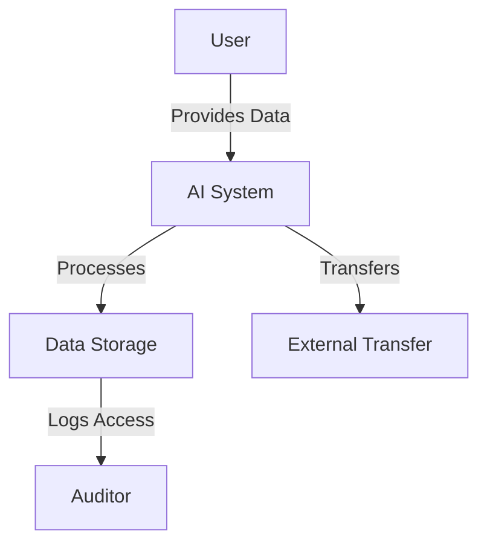

# GDPR Compliance Audit Report

This is the final consulting-style audit report for the Healthcare AI GDPR Compliance Assessment project. It consolidates all findings, analyses, and recommendations into a single, structured document.

---

## 🎯 Executive Summary
This assessment was conducted on a simulated Healthcare AI system processing radiology diagnostics data. The system handles special category data under GDPR (Article 9) and poses compliance risks if not properly secured.

**Key Findings:**
- Unencrypted storage of diagnosis codes.
- Non-EU data transfers without documented consent.
- Lack of defined data retention policy.
- Insufficient logging and monitoring.
- Incomplete Privacy by Design documentation.

**Recommendations:**
- Implement field-level encryption and pseudonymization.
- Validate and store explicit user consent.
- Define and enforce retention policies.
- Improve SIEM monitoring with defined detection rules.
- Conduct regular DSFA reviews with DPO.

---

## 📌 Methodology
- Simulated log data analysis in Jupyter.
- Feature engineering to identify consent, EU/Non-EU transfers.
- Privacy by Design checklist review.
- GDPR field-to-article mapping.
- Detection rule design for SIEM systems.
- Threat modeling (STRIDE) for AI-specific risks.
- DSFA outline with quantified risk assessment.
- Ethical AI considerations for bias, transparency, human oversight.

---

## 📌 Dataflow Diagram
*(Include your draw.io or Mermaid diagram here)*

Example:

